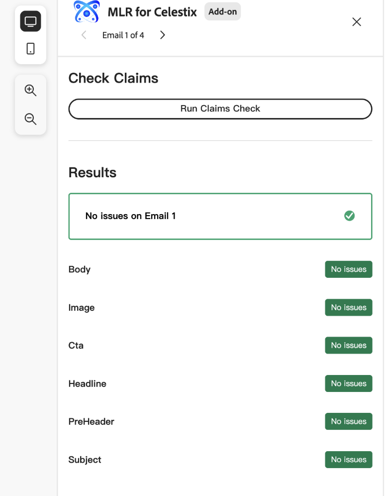
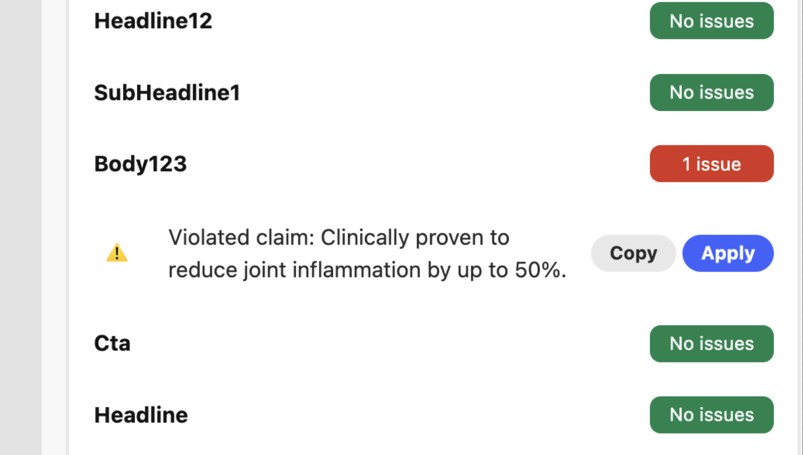
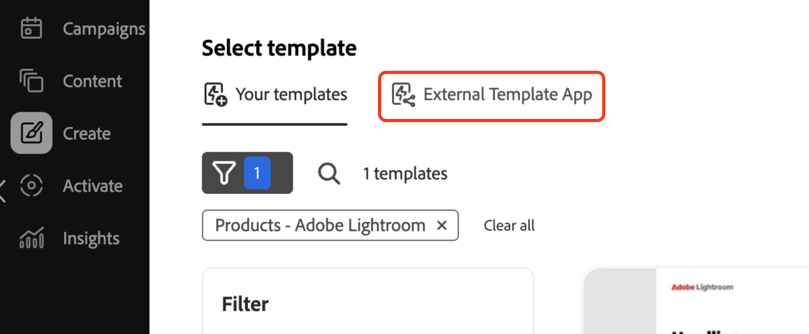

# Implemente la aplicación

La ejecución de la aplicación ofrece una instantánea preliminar del comportamiento del complemento antes de implementarlo. Esto puede ayudar con la depuración.

## Ejecute la aplicación

Ejecutar la aplicación en `https://localhost:9080`:

```bash
aio app run
```

## Implemente la aplicación

1. Vaya al espacio de trabajo de implementación:

   ```bash
   aio app use -w [deployment_workspace]
   ```

2. Implemente la aplicación:

   ```bash
   aio app deploy
   ```

## Forzar reimplementación

Puede forzar una compilación e implementación de su aplicación sin volver a enviarla para su aprobación.

>[!NOTE]
>
>Forzar una compilación e implementación sobrescribe la implementación existente. **Primero pruebe exhaustivamente su aplicación** en un entorno de prueba.

```bash
aio app build --force-build
```

```bash
aio app deploy --force-deploy
```

## Generar e implementar al mismo tiempo

```bash
aio app deploy --force-build --force-deploy
```

## Encuentre su nueva aplicación

Después de la implementación, puede ver la nueva aplicación en GenStudio for Performance Marketing.

### Ver con una dirección URL

Vea la nueva aplicación agregando un parámetro `query` a la dirección URL de GenStudio for Performance Marketing:

```txt
https://experience.adobe.com/?ext=https://<my-deployed-add-on>.adobeio-static.net/index.html#/@<ims-org>/genstudio/create
```

### Ver en la interfaz de usuario

Las nuevas extensiones se encuentran en diferentes ubicaciones de la interfaz de usuario, según el tipo de extensión que haya implementado. Los puntos de extensión disponibles actualmente son:

* Extensión de cumplimiento, que incluye:
   * [*solicitar puntos de extensión*](#find-prompt-extensions), que permiten a los clientes agregar contexto adicional a la generación de LLM, y
   * [*puntos de extensión de validación*](#find-validation-extensions), que permiten a los clientes validar el contenido generado desde LLM. La validación suele ir acompañada de la extensión Prompt para garantizar que el contenido generado con una solicitud ampliada se ajuste a los requisitos del cliente (por ejemplo, reclamaciones de medicamentos médicos o reclamaciones legales)
* [Extensión de administración de activos digitales (DAM)](#find-dam-extensions)
* [Extensión de plantilla](#find-template-extensions)
* [Extensión de traducción](#find-translation-extensions)

### Buscar extensiones de mensajes

Las extensiones Prompt se encuentran en el menú desplegable **Complementos**, en la sección **parámetros** de una plantilla.

{width="600" zoomable="yes"}

Se abrirá el cuadro de diálogo del complemento, que le permite seleccionar el contexto adicional que desea añadir para la generación LLM.

{width="600" zoomable="yes"}

### Buscar extensiones de validación

Las extensiones de validación se pueden encontrar después de una generación de mensajes, en el lado derecho se muestra con los resultados.

{width="600" zoomable="yes"}

Ejecute la extensión seleccionada para validar el contenido generado.

{width="600" zoomable="yes"}

Cuando haya errores, puede utilizar la extensión para actualizar la copia de experiencias mediante programación. Al hacer clic en el botón **[!UICONTROL Copiar]**, se copiará el texto sugerido en el portapapeles. Al hacer clic en el botón **[!UICONTROL Aplicar]**, se aplicará el texto a un cuadro de texto específico de la experiencia generada.

{width="600" zoomable="yes"}

### Buscar extensiones DAM

Las extensiones de administración de activos digitales (DAM) se encuentran al seleccionar contenido en la **sección de parámetros** de una plantilla. Consulte la parte inferior del menú desplegable **Seleccionar ubicación** para ver los complementos.

{width="600" zoomable="yes"}

### Buscar extensiones de plantilla

Las extensiones de plantilla se encuentran en la ficha **Aplicación de plantilla externa** al seleccionar una plantilla. Esta pestaña solo aparece cuando hay aplicaciones de plantilla para seleccionar.

{width="600" zoomable="yes"}


### Buscar extensiones de traducción

Utilice los puntos de extensión de traducción para traer su propio servicio de traducción a través de un proxy en lugar de utilizar la traducción predeterminada de GenStudio.
No hay ninguna ubicación de interfaz de usuario para estas extensiones.

Si la extensión está registrada, se utiliza el servicio de traducción proporcionado. De lo contrario, se utiliza el servicio de traducción predeterminado de GenStudio.


Si está satisfecho con el complemento, está listo para distribuirlo sin el parámetro `query`.

Ahora puedes [distribuir tu aplicación](distribute-app.md).
