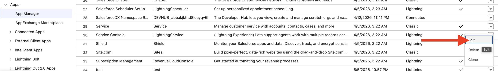
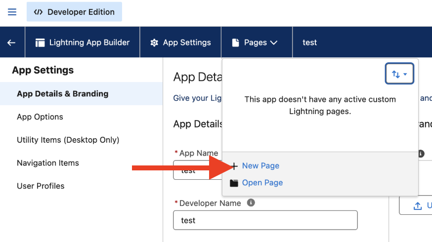

# MFE del selector de experiencias en Salesforce

En este tema se explica cómo los clientes y los implementadores pueden implementar y ejecutar el micro front-end (MFE) del selector de experiencias [!DNL GenStudio for Performance Marketing] en una organización de Salesforce. Abarca los pasos del administrador (sin código), los pasos del desarrollador (implementar y configurar) y la configuración relacionada con la seguridad, como la Política de seguridad de contenido (CSP).

Para obtener opciones genéricas de integración de MFE, propiedades de configuración y ejemplos de estructuras de trabajo, consulte [GenStudio Experience Selector MFE](experience-selector.md).

## Qué hace esta integración

>[!VIDEO](https://video.tv.adobe.com/v/3491079?learn=on)

El componente web Lightning (LWC) `sfgsmfe` carga el paquete UMD del selector de experiencias de Adobe y lo procesa en un `<dialog>` para que los usuarios puedan elegir una experiencia de [!DNL GenStudio for Performance Marketing].

La integración también puede:

* **Vista previa y descodificación:** muestra la carga útil seleccionada como JSON, HTML descodificado y una vista previa de HTML saneada dentro del LWC.
* **Plantillas de correo electrónico (opcional):** Un flujo de **[!UICONTROL Crear plantilla de correo electrónico]** en Salesforce puede llamar a Apex (`EmailTemplateController.createEmailTemplate`) para insertar un registro `EmailTemplate` (HTML, asunto y carpeta).

El script del Selector de experiencia para [!DNL GenStudio for Performance Marketing] se carga desde la dirección URL alojada de Adobe en `experience.adobe.com`, no desde un recurso estático de Salesforce en la implementación típica.

## Requisitos previos

* **Organización de Salesforce:** Una zona protegida u organización de producción donde puede implementar metadatos y usar **[!UICONTROL Lightning App Builder]**.
* **CLI de Salesforce:** La CLI de Salesforce (`sf`) está instalada y autenticada, por ejemplo:

  ```bash
  sf org login web --alias <your-org-alias>
  ```

* **Permisos:** Los usuarios que crean plantillas de correo electrónico necesitan acceso a la carpeta de plantillas de correo electrónico de destino y derechos para crear plantillas de acuerdo con las directivas de su organización. Apex ejecuta `with sharing`.
* **Adobe / GenStudio:** Su ID de organización de Adobe IMS y SUSI `clientId` deben coincidir con la configuración de Adobe (consulte [Configurar valores de integración](#configure-integration-values-developer--implementation)).
* **Explorador / CSP:** Salesforce debe permitir la carga de scripts desde `https://experience.adobe.com` (consulte [Configurar la directiva de seguridad de contenido y la URL de Adobe](#configure-content-security-policy-and-adobe-url)).

## Implementación del paquete (desarrollador)

El proyecto utiliza el diseño Salesforce DX; el directorio de paquetes predeterminado es `force-app`.

1. Desde la raíz del proyecto, implemente el origen en la organización de destino:

   ```bash
   sf project deploy start --source-dir force-app --target-org <your-org-alias>
   ```

2. Confirme que la implementación se completa sin errores.

* `force-app/main/default/lwc/sfgsmfe`: paquete LWC (HTML, JS, CSS, meta).
* `force-app/main/default/classes/EmailTemplateController.cls` — Apex para la creación de plantillas.

El repositorio también puede contener recursos estáticos (`reactApp`, `sfgsmfe_react`). El cargador actual [!DNL GenStudio for Performance Marketing] en `sfgsmfe.js` usa la dirección URL de CDN de Adobe para `standalone.js`; esos recursos estáticos no son necesarios para esa ruta de carga a menos que cambie la implementación.

## Añadir el componente a una página de Lightning (administrador)

El componente `sfgsmfe` está expuesto para:

* Páginas de aplicación de Lightning
* Páginas principales
* Registrar páginas
* Pestañas (a través de una página de Lightning en una pestaña personalizada)

Para añadir el componente:

1. En **[!UICONTROL Configuración]**, abra **[!UICONTROL Administrador de aplicaciones]**.
1. Crea una **[!UICONTROL nueva aplicación Lightning]** (o abre una aplicación existente que quieras ampliar).
   {width="80%" zoomable="yes"}
1. Abra la aplicación y seleccione **[!UICONTROL Editar]**.
   {width="80%" zoomable="yes"}
1. Crear **[!UICONTROL nueva página]** (o editar una página existente de Lightning).
   {width="60%" zoomable="yes"}
1. En **[!UICONTROL Lightning App Builder]**, arrastre el componente **sfgsmfe** al diseño.
1. **[!UICONTROL Guardar]**, **[!UICONTROL Activar]** y asignar la página a la aplicación Lightning, a los perfiles y a la visibilidad de la aplicación correctos para que los usuarios previstos puedan abrirla.

## Configuración de la política de seguridad de contenido y la URL de Adobe

El LWC inserta una etiqueta `<script>` cuyos `src` puntos en el paquete UMD de Adobe, por ejemplo:

`https://experience.adobe.com/solutions/GenStudio-experience-selector-mfe/static-assets/resources/@genstudio/experience-selector/umd/standalone.js`

Debe configurar Salesforce para que este origen se permita para la carga de scripts según la configuración de seguridad CSP y Lightning de su organización.

Si el script no se puede cargar:

1. Abra las herramientas para desarrolladores de exploradores.
1. Compruebe las fichas **[!UICONTROL Consola]** y **[!UICONTROL Red]** para ver si hay solicitudes bloqueadas o infracciones de CSP.
1. Añada o ajuste **[!UICONTROL URL de confianza]** (y cualquier configuración relacionada para su versión de Salesforce) para `https://experience.adobe.com`, según la documentación actual de Salesforce para Lightning.
   {width="80%" zoomable="yes"}

## Configurar valores de integración (desarrollador/implementación)

Se han establecido varios valores en la JavaScript LWC para `sfgsmfe`. Normalmente, los clientes sustituyen estos por entorno.

| Valor | Descripción |
| --- | --- |
| `folderId` | Id. de carpeta Salesforce (`00l...`) para plantillas de correo electrónico en las que se crean nuevas plantillas. Necesario para Apex; la carpeta debe existir y ser accesible para el usuario en ejecución. |
| `imsOrg` | Identificador de organización IMS de Adobe pasado a `GenStudioExperienceSelector.renderExperienceSelectorWithSUSI`. |
| `susiConfig.clientId` | ID de cliente de Adobe SUSI para el registro de la aplicación del Selector de experiencia. |
| GenStudio `script.src` | URL del paquete UMD `standalone.js`; actualizar si Adobe publica una nueva ruta. |

La creación de plantillas de correo electrónico asigna campos de GenStudio a la plantilla (por ejemplo, asunto de `experienceFields`). Ajuste las asignaciones en el LWC si el modelo de contenido es diferente.

Para obtener más información sobre `renderExperienceSelectorWithSUSI` y las opciones relacionadas, consulte [Propiedades de configuración](experience-selector.md#configuration-properties) en el tema de MFE del Selector de experiencia.

## Apex: EmailTemplateController

`EmailTemplateController.createEmailTemplate` normalmente:

* Valida el nombre de la plantilla, el ID de carpeta y HTML que no esté vacío.
* Crea un(a) `EmailTemplate` con `TemplateType = 'custom'`, `HtmlValue`, `Subject`, `Body` y la asignación de carpeta.
* Muestra errores en el LWC a través de `AuraHandledException`.

Sugerencias operativas:

* Respete la exclusividad de DeveloperName y las reglas de nomenclatura en la organización.
* Confirme el ID de carpeta y que el usuario puede crear `EmailTemplate` registros en esa carpeta.
* Utilice registros de depuración de Salesforce cuando DML no pueda capturar el error exacto.

## Lista de comprobación de validación

Confirme los elementos de esta lista después de la implementación y la configuración para una validación segura de la integración:

1. La implementación se completa sin errores.
1. Los usuarios pueden abrir la página de Lightning que contiene `sfgsmfe` y ver la interfaz de usuario del selector de experiencias.
1. El componente no muestra un error de carga; la ficha Red devuelve HTTP 200 para `standalone.js`.
1. **[!UICONTROL Seleccionar una experiencia de GenStudio]** abre el selector y se ejecutan las devoluciones de llamadas de selección.
1. **[!UICONTROL Crear plantilla de correo electrónico]** se realiza correctamente cuando se usa ese flujo, y la plantilla aparece en la carpeta configurada en **[!UICONTROL Configuración]**.

## Consulte también

* [Selector de experiencia GenStudio MFE](experience-selector.md)
