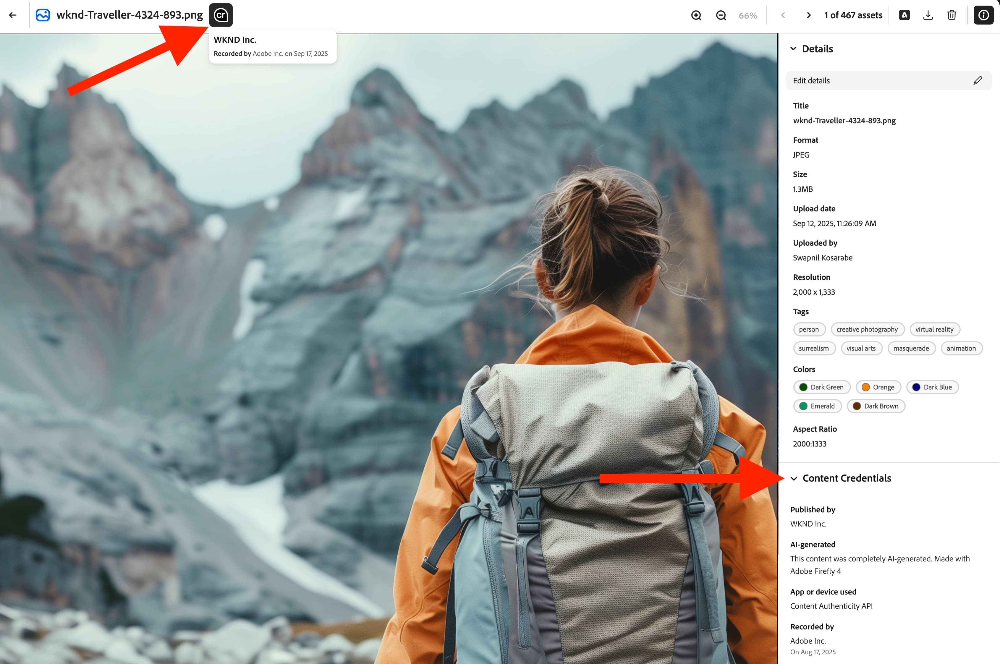
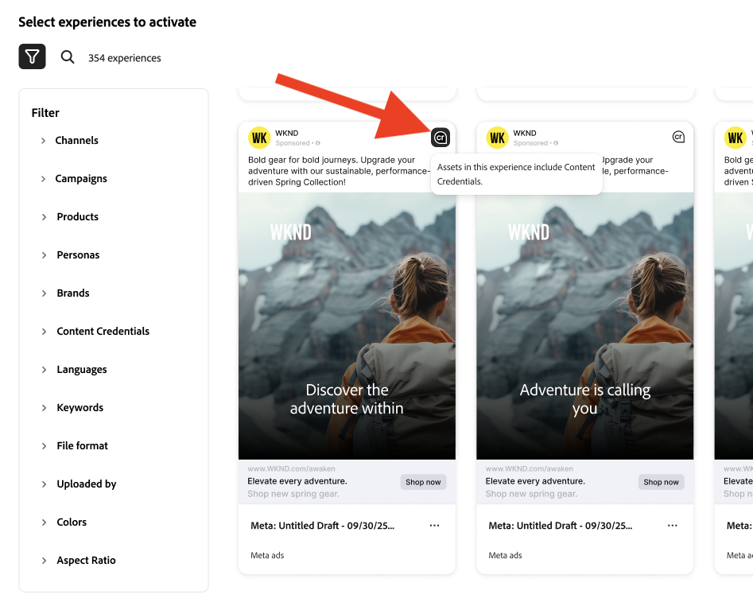

# Content Credentials para organizaciones

Descubra cómo las credenciales a prueba de manipulaciones para el contenido que demuestra la autenticidad de la marca y fomenta el cumplimiento están integradas directamente en el flujo de trabajo de marketing.

>[!WARNING]
>
> Actualmente, esta función está en versión beta y solo está disponible para las organizaciones a las que se les ha concedido acceso. Si está interesado, póngase en contacto con el representante del equipo de su cuenta de Adobe o [utilice este vínculo para solicitar la inscripción](https://www.feedbackprogram.adobe.com/c/a/5aWPEOthrDv22Mf9CyekOy?source=qr).

## Introducción a Content Credentials {#content-credentials}

>[!CONTEXTUALHELP]
>id="gspm_content_credentials"
>title="Content Credentials en [!DNL GenStudio for Performance Marketing]"
>abstract="Las credenciales a prueba de manipulaciones para el contenido que prueba la autenticidad de la marca y fomenta el cumplimiento se pueden incrustar directamente en el flujo de trabajo de marketing."

Una vez activado Content Credentials en Admin Console, los usuarios de GenStudio for Performance Marketing pueden activar Content Credentials para todos los recursos globalmente en la aplicación. Si la opción global para aplicar credenciales está desactivada, los usuarios tienen la opción de aplicar Content Credentials a cada recurso individual.

Una vez publicado el contenido, Content Credentials será visible en plataformas externas, como LinkedIn.

Los administradores son responsables de cargar un certificado X.509 válido en Admin Console. Este paso garantiza que la firma digital de la empresa esté configurada correctamente y lista para su uso en aplicaciones Adobe DX compatibles.

>[!NOTE]
>
>El control de esta configuración podría hacer la transición a Admin Console en el futuro, lo que optimizaría la administración de Content Credentials en todas las aplicaciones y mejoraría la supervisión administrativa.

## ¿Qué es Content Credentials? 

Content Credentials es un tipo de metadatos duradero y estándar en el sector con detalles sobre cómo se creó el contenido e información de identidad sobre los creadores. Content Credentials se puede ver cuando el contenido se publica en línea en plataformas compatibles o con herramientas como [Adobe&#39;s Inspect tool](https://contentauthenticity.adobe.com/inspect) o la [extensión del explorador Adobe Content Authenticity Chrome](https://helpx.adobe.com/creative-cloud/help/cai/adobe-content-authenticity-chrome-browser-extension.html).  

La aplicación de Content Credentials puede ayudar a aumentar la transparencia sobre cómo se creó el contenido y puede ayudar a los usuarios a conectarse con su contenido.

[Más información sobre Content Credentials](https://helpx.adobe.com/creative-cloud/help/content-credentials.html) en Adobe.

## Firma de marca y seguimiento de recursos

El contenido firmado por una marca desempeña un papel importante en la promoción de la integridad de la marca y la confianza del usuario. Organizations can sign their content with a unique brand signature in Adobe applications when their certificate is properly configured in the Admin Console. This assurance of authenticity is maintained using invisible watermarking and fingerprinting technologies, which help preserve the durability of the signature throughout the content&#39;s lifecycle.

In addition to brand signing, enterprises can attach asset IDs directly to their content. This facilitates efficient tracking of assets, particularly when they are shared or posted on social media platforms. By incorporating asset IDs, organizations can trace the origin and distribution path of their content, enhancing oversight and accountability.

## Content Credentials in the marketing workflow

Applying Content Credentials can be done throughout the marketing workflow directly in GenStudio for Performance Marketing, from import and content discovery to activation and export. You&#39;ll also find credentials displayed on content for review throughout the app.

### Import and discovery

In the Content gallery, credentials are displayed on imported assets.

The Content Credential badge in the upper right corner of the thumbnail indicates &quot;Brand signed&quot; content.

Selecting signed content displays the detailed metadata: published brand, recorder, tool used, timestamp.

Content can be filtered by credential status.

### Creation and selection

Content Credential badges are shown in the Canvas asset selector.

Credential metadata is preserved as assets are selected for experiences to maintain the provenance chain throughout editing.

### Editing and transformation

During exports from a draft, modified assets are automatically re-signed and the new credential links to the original.

{width="60%"}

### Review and approval

In the Review and Approve preview, credential status is displayed for assets on the right rail.

{width="60%"}

Los detalles de credenciales por variante se muestran cuando los revisores inspeccionan los recursos. Las experiencias aprobadas se vuelven a firmar cuando los usuarios hacen clic en **[!UICONTROL Guardar en contenido]**.

### Activación y exportación

Durante la activación, el estado de las credenciales se muestra en el selector de experiencias.

{width="60%"}

Los archivos exportados tendrán credenciales compatibles con C2PA incrustadas.

La integridad de las credenciales se mantiene en todos los formatos admitidos (JPEG, PNG, MP4).

