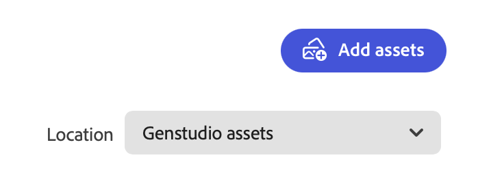

# Administración de recursos y experiencias

Adobe GenStudio for Performance Marketing [!DNL Content] simplifica y mejora la administración de los recursos aprobados por la marca para su uso y reutilización en el recorrido de marketing digital.

## Galería de contenido

La galería muestra un inventario de recursos, experiencias o plantillas aprobados según la vista seleccionada. El icono de filtro (canal) situado encima de la parte izquierda de la tabla abre el menú **[!UICONTROL Filtro]**, donde puede seleccionar entre muchas categorías para filtrar el contenido mostrado en la galería. En la vista _[!UICONTROL Assets]_, haga clic en el icono de búsqueda (lupa) para usar una palabra clave para encontrar un recurso.

A continuación se muestra una búsqueda del término `dog` en la galería [!UICONTROL Assets]:

### Buscar contenido

La interfaz de filtro y búsqueda es rápida y adaptable, y proporciona una experiencia productiva de búsqueda en primer lugar. Cada vista de [!DNL Content] proporciona opciones de filtro para restringir la búsqueda del recurso, la experiencia o la plantilla ideales. Para los recursos y las experiencias, puede seleccionar una campaña y directrices específicas, como el contenido creado para un producto específico.

Hay filtros basados en [keywords](asset-details.md#user-defined-metadata) y [categorías de atributos](/help/user-guide/insights/attribute-category.md) para reducir los resultados de búsqueda. Por ejemplo: es posible que desee encontrar un recurso de un tipo de archivo o tema en particular para que le ayude a crear una nueva experiencia para su campaña.

Al buscar _Experiencias_, puede usar el filtro **[!UICONTROL Creado por]** para limitar la lista y mostrar únicamente las experiencias creadas por usted o por una persona específica.

**Para buscar contenido para reutilizarlo**:

1. En _[!DNL Content]_, seleccione la sección **[!UICONTROL Assets]**.

1. Seleccione un repositorio de recursos de la lista **[!UICONTROL Ubicación]** o verifique que está viendo el repositorio de recursos correcto. `GenStudio assets` es el repositorio predeterminado.

   >[!IMPORTANT]
   >
   >AEM La lista _Ubicación_ solo está disponible cuando [te conectas a un repositorio de](connect-aem-repo.md).

1. Haga clic en **[!UICONTROL Buscar]** (lupa) para escribir una palabra clave o descripción.

1. Reduzca la búsqueda seleccionando una categoría de la lista _[!UICONTROL Filtro]_. Por ejemplo, si está buscando un archivo PNG, haga clic en **[!UICONTROL Formato de archivo]** y elija **PNG**.

   Cuanto más limitada sea la búsqueda, menos opciones de filtro estarán disponibles. Haga clic en **[!UICONTROL Borrar todo]** para eliminar todos los filtros.

1. Seleccione un recurso para obtener una vista completa y una lista de detalles.

   Haga clic en **[!UICONTROL Descargar]** (flecha abajo) para usar el recurso en la estación de trabajo local.

### Lugar de residencia

De manera predeterminada, los recursos que agrega a [!DNL Content] a través del proceso [!DNL Create] o de la carga se almacenan en el repositorio `GenStudio assets`. El repositorio `GenStudio assets` es de lectura y escritura en GenStudio for Performance Marketing. Esto significa que puede guardar, editar y eliminar recursos en el repositorio `GenStudio assets`.

La lista **[!UICONTROL Location]** sobre la galería _[!UICONTROL Assets]_ a la derecha te permite seleccionar entre repositorios conectados de Adobe Experience Manager AEM () [!DNL Assets Content Hub].

{width="350"}

AEM Al seleccionar un repositorio de, la galería muestra un inventario de los recursos de ese repositorio, lo que le permite aprovechar los recursos aprobados de estos repositorios como entradas para la creación de contenido. Las opciones de filtro cambian para reflejar las categorías configuradas en [!DNL AEM Assets Content Hub].

AEM Consulte [Conectar un repositorio de](connect-aem-repo.md) para obtener instrucciones sobre cómo agregar el repositorio [!DNL AEM Assets Content Hub] a GenStudio for Performance Marketing.

AEM AEM El repositorio de es de solo lectura, lo que significa que puede acceder al contenido, pero no puede guardar borradores, nuevos recursos ni metadatos en el repositorio de la. Todos los borradores y las actualizaciones finales de los recursos, las experiencias y las plantillas se guardan en el repositorio `GenStudio assets` con los nuevos [metadatos del sistema](asset-details.md#system-metadata).

{{note-aem-assets}}

## Administración de Assets

En [!UICONTROL Contenido], Marketing de rendimiento puede almacenar, recuperar y administrar fácilmente sus recursos digitales. AEM Al aprovechar tanto el repositorio `GenStudio assets` como los repositorios de la, los usuarios pueden asegurarse de que sus recursos estén bien organizados y sean accesibles para diversas campañas de marketing. Este enfoque de varios repositorios proporciona flexibilidad y control sobre el uso de los recursos en todos los entornos, lo que garantiza que solo se utilicen recursos aprobados y actualizados en las actividades de marketing.

### Añadir recursos

Al agregar recursos a [!DNL Content], se almacenan de forma predeterminada en el repositorio `GenStudio assets`. El botón _[!UICONTROL Agregar recursos]_ solo está disponible cuando la _[!UICONTROL ubicación]_ es el repositorio `GenStudio assets`.

{width="350"}

**Para agregar uno o más recursos**:

1. En _[!DNL Content]_, haga clic en **[!UICONTROL Agregar recursos]**.

1. En la vista _Agregar los recursos aprobados_, suelte uno o varios archivos en el espacio de colocación. Opcionalmente, puede seleccionar entre archivos locales mediante **[!UICONTROL Examinar]** o importar archivos desde Dropbox o Microsoft OneDrive.

1. En la sección _Agregar detalles_, seleccione un **[!UICONTROL nombre de campaña]** o escriba un nombre nuevo.

1. Para mejorar la capacidad de detección, agregue detalles opcionales como _Nombre de marca_, _Personas_, _Región_ y _Palabras clave_ en la sección **Más detalles**.

   Cuantos más detalles proporcione, más experimentará las sólidas capacidades de GenStudio for Performance Marketing. Seleccione uno o más detalles de la lista o introduzca uno nuevo cuando corresponda, por ejemplo, con palabras clave. Cada detalle que agregue aparecerá debajo de la lista. Haga clic **`x`** para eliminar un detalle.

   Los detalles que agregue se aplicarán a todos los recursos agregados en esta acción.

   Ver [detalles de metadatos](/help/user-guide/content/asset-details.md#system-metadata).

1. Haga clic en **[!UICONTROL Agregar recursos]**.

1. Cuando finalice la carga del recurso, haga clic en **Listo**.

1. Para ver los nuevos recursos que has cargado, haz clic en **[!UICONTROL Actualizar]** en la notificación _Nuevos recursos disponibles_ que aparece en la parte inferior del lienzo.

<!--
In the future, need guidance on template upload errors. For now, the UI just says error.
-->

### Descarga de recursos

**Para descargar un recurso**:

1. En _[!DNL Content]_, seleccione un recurso de imagen. Al hacer clic en un recurso, se abre una vista enfocada del recurso.

1. En la vista de recursos, haga clic en el icono **[!UICONTROL Descargar]** (flecha hacia abajo) en la esquina superior derecha.

1. La descarga comienza a colocar una copia del recurso en la ubicación de descarga predeterminada.

### Eliminar recursos

**Para eliminar un recurso**:

1. En _[!DNL Content]_, seleccione un recurso de imagen. Al hacer clic en un recurso, se abre una vista enfocada del recurso.

1. En la vista de recursos, haga clic en el icono **[!UICONTROL Eliminar]** (papelera) en la esquina superior derecha.

1. En la ventana emergente _Eliminar recurso_, verifique el recurso y haga clic en **[!UICONTROL Eliminar]**.

## Editar en Express

JPG Puede editar recursos de imagen (o PNG) directamente en GenStudio for Performance Marketing mediante el Adobe Express. El lienzo _[!UICONTROL Powered by Adobe Express]_ proporciona funciones prácticas para mejorar tus imágenes sin salir de la aplicación GenStudio. Puede quitar fondos fácilmente, aplicar rellenos generativos, ajustar efectos y recortar imágenes.

>[!BEGINSHADEBOX]

Criterios para mejorar imágenes con la característica [!DNL Edit in Adobe Express]:

- Los tipos MIME admitidos son `image/png` y `image/jpeg`
- Las dimensiones mínimas de la imagen son de 50 x 50 píxeles
- Las dimensiones máximas de la imagen son de 8000 x 8000 píxeles
- El tamaño máximo es 40 MB (40 000 000 bytes)

>[!ENDSHADEBOX]

**Para editar un recurso con Express**:

1. En _[!DNL Content]_, seleccione un recurso de imagen. Al hacer clic en un recurso, se abre una vista enfocada del recurso.

1. En la vista de recursos, haga clic en el Adobe Express **[!UICONTROL Editar en]** en la esquina superior derecha.

1. En el lienzo _[!UICONTROL Powered by Adobe Express]_, usa los controles Express del panel izquierdo para mejorar tu imagen.

1. Cuando esté satisfecho con la imagen actualizada, haga clic en **[!UICONTROL Guardar una copia]** en la esquina superior derecha.

1. Seleccione el formato de archivo (JPG o PNG) y haga clic en **[!UICONTROL Guardar una copia]**.

1. En la ventana emergente _[!UICONTROL Guardar una copia del recurso]_, actualice **[!UICONTROL Nombre del recurso]**.

   - Seleccione **[!UICONTROL Mismos detalles que el recurso original]** para transferir los detalles del recurso a la nueva imagen.

   - Expanda la sección **[!UICONTROL Más detalles]** para actualizar la campaña, las directrices y otros metadatos.

   >[!TIP]
   >
   >Cuantos más detalles proporcione, más experimentará las sólidas capacidades de GenStudio for Performance Marketing. Seleccione uno o más detalles de la lista o introduzca uno nuevo cuando corresponda, por ejemplo, con palabras clave. Cada detalle que agregue aparecerá debajo de la lista. Haga clic **`x`** para eliminar un detalle.

1. Haga clic en **[!UICONTROL Guardar]**.
