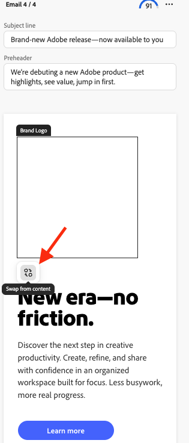
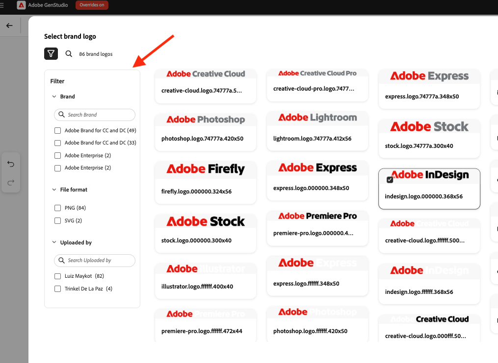

# Usar intercambio de logotipo en [!DNL Create]

Use el intercambio de logotipos para reemplazar los logotipos de marca en las plantillas durante la creación de contenido en [!DNL GenStudio for Performance Marketing].

## Requisitos previos

- Configurar plantillas utilizando la [guía de configuración de intercambio de logotipos](logo-swap-setup.md). El icono de intercambio de logotipos solo aparece para plantillas que incluyen los marcadores de posición de logotipo necesarios.
- Para tener logotipos intercambiables durante el flujo de trabajo **[!DNL Create]**, debe haber logotipos almacenados en **[!DNL Brands]**.

## Intercambiar un logotipo durante la creación del contenido

1. En **[!DNL Create]**, seleccione un canal en la página de aterrizaje.
1. Elija una plantilla que incluya un logotipo intercambiable. La vista previa de la plantilla muestra un cuadro de marcador de posición gris donde aparece el logotipo.
   {width="300"}
1. Cree contenido como de costumbre. Aparecen cuatro variantes.
1. Pase el ratón sobre el área del logotipo para mostrar el marcador de posición.
   {width="200"}
1. Haga clic en el área Logotipo de marca y, a continuación, haga clic en **[!UICONTROL Intercambiar del contenido]**.
   {width="200"}
1. En el panel Logotipo de marca, selecciona un logotipo y haz clic en **[!UICONTROL Usar]** para aplicarlo a la variante actual o en **[!UICONTROL Aplicar a todas las variantes]** para aplicarlo a las cuatro variantes.
1. También puede buscar logotipos por nombre de marca o filtrar para encontrar un logotipo.
   {width="300"}
1. O utilice un filtro para buscar un logotipo.
   {width="300"}
1. Con el logotipo intercambiado correctamente, continúe con el flujo de trabajo de creación de contenido (cierre el borrador, la exportación o solicite la aprobación).

Los logotipos se pueden volver a intercambiar en cualquier momento.

>[!NOTE]
>Si no aparece el icono de intercambio de logotipos, confirme que la plantilla está configurada para el intercambio de logotipos y que los logotipos están disponibles en [!DNL Brands].
