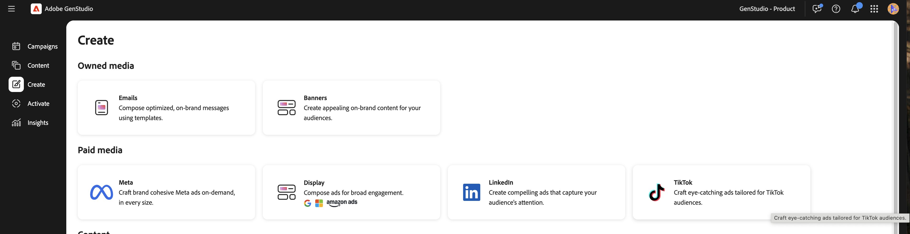
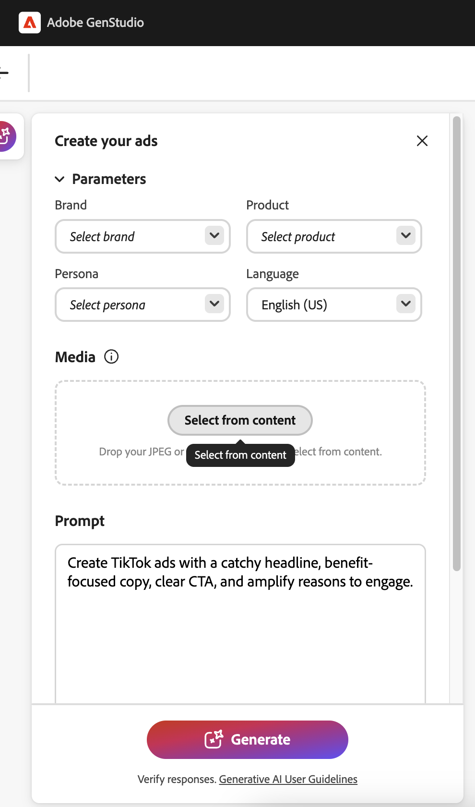

# Experiencias de TikTok

Con [!DNL GenStudio for Performance Marketing], puede crear anuncios de TikTok como experiencias de medios de pago en el flujo de trabajo [[!DNL Create]](/help/user-guide/create/overview.md). Genere variantes creativas, ejecute comprobaciones de marca y canal, publique en [!DNL Content] y actívelo a través de [[!DNL Activate]](/help/user-guide/activation/overview.md) para entregar contenido al administrador de TikTok Ads para su revisión final y lanzamiento.

TikTok en [!DNL GenStudio for Performance Marketing] encaja en un flujo de trabajo omnicanal más amplio: puede analizar el rendimiento de la campaña de TikTok y de la publicidad en [[!DNL Insights]](/help/user-guide/insights/overview.md) junto con otros canales sociales y de visualización (como Meta y LinkedIn), en lugar de cambiar a herramientas de creación de informes independientes.

[!DNL Insights] muestra métricas, entre ellas:

* Impresiones
* Clics
* Tasa de clics (CTR)
* Costo por clic (CPC)
* Coste por adquisición (CPA)
* Coste por kilómetro (CPM)
* Gasto

Vea sus resultados, compare la eficacia creativa y perfeccione la segmentación y los presupuestos, todo en el mismo lugar. Las actualizaciones diarias de datos le ayudan a optimizar con mayor rapidez sin salir de [!DNL GenStudio for Performance Marketing].

## Requisitos previos

Antes de crear o activar anuncios de TikTok, complete lo siguiente:

### Acceso y función

Asegúrese de que tiene la función **Editor** o superior en GenStudio for Performance Marketing. Consulte [Funciones de usuario y permisos](/help/user-guide/user-roles.md).

### Conecte su cuenta de TikTok Ads

1. Vaya a **[!UICONTROL Configuración]** > **[!UICONTROL TikTok]** > **[!UICONTROL Administrar]** > **[!UICONTROL Agregar cuenta]**.
1. En la ventana emergente, inicie sesión en el Administrador de TikTok Ads.
1. Asegúrese de que tenga acceso de **Operador** o **Administrador** a la cuenta publicitaria.
1. Añada TikTok como canal y complete el inicio de sesión de OAuth en el Administrador de TikTok Ads.

### Activar configuración

Un administrador del sistema ha conectado su cuenta de TikTok Ads en [!DNL Activate]:

* Al menos una cuenta de publicidad de TikTok está habilitada para su uso.

### Crear configuración

* Su [marca, productos y personalidades](/help/user-guide/guidelines/overview.md) están configurados para que la aplicación pueda generar copias y diseños que no sean de marca.
* Se ha cargado al menos una plantilla de TikTok. Adobe recomienda una plantilla de vídeo vertical para TikTok, optimizada para la ubicación en la fuente, con una relación de aspecto de **9:16** y zonas seguras para la interfaz de usuario superior e inferior.
* Los vídeos se han cargado a [!DNL Content].

## Generación de un anuncio en la fuente de TikTok

### Iniciar una experiencia de TikTok

{width="90%"}
**Para iniciar una experiencia de TikTok**:

1. Vaya a **[!UICONTROL Crear]** y elija **[!UICONTROL TikTok]**.
1. Seleccione una plantilla de TikTok y haga clic en **[!UICONTROL Usar]**.
1. En el lienzo, seleccione **[!UICONTROL Marca]**, **[!UICONTROL Producto]**, **[!UICONTROL Persona]** y **[!UICONTROL Idioma]**.
1. Seleccionar un vídeo de [!DNL Content].
1. Escriba un mensaje para la copia de titular de TikTok.
1. Haga clic en **[!UICONTROL Generar]**.
   {width="40%"}

GenStudio for Performance Marketing genera cuatro variantes creativas.

Puede:

* Use **[!UICONTROL Regenerar]** o **[!UICONTROL Refinar]** para ajustar el tono, la longitud o el énfasis.
* Editar texto directamente en el lienzo.
* Use **[!UICONTROL Intercambiar]** para seleccionar un vídeo alternativo de [!DNL Content].
* Use **[!UICONTROL Recortar]** o **[!UICONTROL Reframe]** para ajustar el diseño del vídeo dentro del fotograma **9:16**.

### Ejecución de comprobaciones de marca y canal

Antes de guardar o enviar la experiencia para su revisión, ejecute comprobaciones de contenido:

1. Haga clic en **[!UICONTROL Comprobación de contenido]** (comprobaciones de marca y canal).
1. Revisar los resultados de validación de:
   * **Directrices de marca**: tono, términos restringidos, uso del logotipo.
   * **reglas de canal de TikTok**: proporción de aspecto, tipo de archivo y longitud de copia.
1. Resuelva los problemas marcados (por ejemplo, longitud de copia o texto denso en pantalla).

Consulte [Validación de marca](/help/user-guide/guidelines/brand-validation.md) para obtener más información sobre las comprobaciones de contenido.

## Guardar un anuncio de TikTok en GenStudio for Performance Marketing

Mueva su experiencia de TikTok a la biblioteca [!DNL Content] para que se pueda revisar, reutilizar y activar.
Hay dos estados:

* **Experiencia de borrador**: Un trabajo en curso y no aprobado.
* **Experiencia publicada**: contenido aprobado y disponible en [!DNL Content] para su activación.

### Enviar para revisión

**Para enviar para revisión**:

1. En el encabezado **[!DNL Experience]**, haga clic en **[!UICONTROL Solicitar revisión]**.
1. Seleccione aprobadores (por ejemplo, marca, legal o rendimiento).
   * (Opcional) Agregue una nota en **[!UICONTROL Configuración]**.
1. Haga clic en **[!UICONTROL Enviar para revisión]**.

Los aprobadores pueden ver la vista previa del vídeo, la descripción, call to action (CTA) y los resultados de las comprobaciones de marca y canal. Pueden aprobar la experiencia o solicitar cambios.

### Publicar en [!DNL Content]

Después de todas las aprobaciones requeridas:

1. Haga clic en **[!UICONTROL Publicar en contenido]**.
1. Confirmar metadatos:
   * Campaña o nombre de activación
   * Región, idioma, persona, fase de funnel
   * Canal: TikTok
1. Haga clic en **[!UICONTROL Publicar]**.

El anuncio de TikTok ahora aparece en [!DNL Content]. Se puede detectar mediante filtros como [!DNL Channel] o [!DNL Campaign], y está listo para su selección en [!DNL Activate].

## Activar un anuncio de TikTok

La activación de TikTok utiliza el mismo módulo [!DNL Activate] que Meta y Campaign Manager 360 (CM360). Puede comenzar desde el flujo de trabajo [!DNL Content] o desde el flujo de trabajo [!DNL Activate].

**Para iniciar una activación de TikTok**:

1. Abra el mosaico del canal de TikTok.
1. Haga clic en **[!UICONTROL Crear activación]**.
1. Seleccione una o más experiencias publicadas de TikTok de [!DNL Content].

Cada experiencia suele asignarse a un anuncio de TikTok, con una o más variantes de vídeo.

### Configurar la configuración de experiencia

Para cada experiencia seleccionada, confirme lo siguiente:

* Texto principal
* Call to action
* URL de destino

### Configurar la configuración de plataforma

Proporcione detalles de TikTok Ads Manager como:

* Cuenta de TikTok Ads
* Campaign
* Grupo de publicidad
* Nombre del anuncio (uno por anuncio de TikTok)

### Revisión y publicación

1. Revise todos los detalles creativos y de la plataforma.
1. Haga clic en **[!UICONTROL Publicar]**.

GenStudio for Performance Marketing envía anuncios al Administrador de anuncios de TikTok en estado de pausa o borrador.

### Qué sucede a continuación

Aparece un modal _Publicación en curso_ que se cierra automáticamente. Se le redirigirá a la tabla de activación de TikTok.

{width="30%"}

La tabla de activación muestra las activaciones más recientes, con un estado **Pendiente** mientras se completa el procesamiento. Puede salir mientras se completa la publicación.

{width="90%"}

Una vez finalizado, una ventana emergente de confirmación muestra un mensaje de éxito o error. Si hace clic en ese elemento emergente o en la activación de TikTok en la tabla de activación, abre la página **Detalles**. La página **Detalles** contiene la información de activación completa y un vínculo profundo al anuncio publicado en el Administrador de TikTok Ads.

Si falla la activación, aparece el estado **Failed** junto con un mensaje de error de TikTok.

En el Administrador de TikTok Ads, los equipos de medios pueden:

* Realizar comprobaciones finales.
* Publique anuncios o grupos de anuncios.

Al igual que otros canales, GenStudio for Performance Marketing ofrece a los creativos un estado inactivo para que los propietarios de los canales controlen el tiempo de lanzamiento final y el presupuesto.
