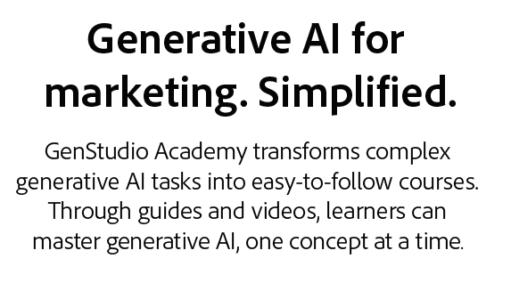

# GenStudio Academy

<table>

 <tr style="border: 0;">

   <td></td>

   <td rowspan="2"></td>

 </tr>

 <tr>

   <td>[!BADGE Register]{type=Informative url="https://learningmanager.adobe.com/accountiplogin?ipId=16970&amp;accesskey=c4988oojirhb5" tooltip="Crear una cuenta de GenStudio Academy"}       [!BADGE Iniciar sesión]{type=Informative url="https://genstudioacademy.adobelearningmanager.com/" tooltip="Iniciar sesión en GenStudio Academy"}</td>

 </tr>

</table>

>[!BEGINSHADEBOX]

<table>

 <tr style="border: 0;">

  <td></td>

  <td></td>

 </tr>

 <tr>

   <td>

   </td>

   <td>

   [!BADGE Explorar ahora]{type=Informative url="https://learningmanager.adobe.com/accountiplogin?ipId=16970&amp;accesskey=c4988oojirhb5" tooltip="Iniciar sesión en GenStudio Academy"}

   </td>

 </tr>

</table>

>[!ENDSHADEBOX]

>[!BEGINSHADEBOX]

<table>

 <tr style="border: 0;">

  <td></td>

  <td></td>

 </tr>

 <tr>

   <td>

   </td>

   <td>

   [!BADGE Llévame allí]{type=Informative url="https://business.adobe.com/products/genstudio-for-performance-marketing.html" tooltip="más información en business.adobe.com"}

   </td>

 </tr>

</table>

>[!ENDSHADEBOX]
