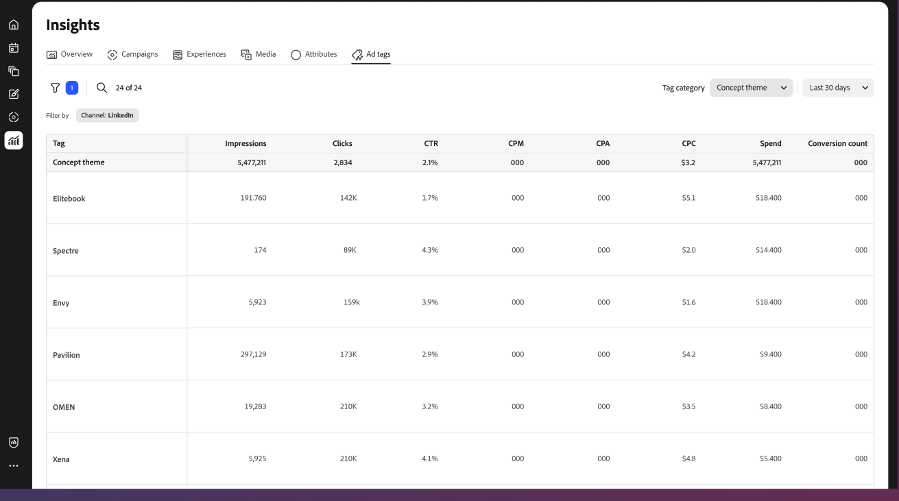

# Información general sobre etiquetas de anuncios

La vista [!DNL Insights] _[!UICONTROL Etiquetas de anuncios]_ muestra una lista de anuncios para la cuenta de anuncio de canal conectada. Un _anuncio_ es un recurso promocional que incluye contenido visual e interactivo que se va a distribuir a una audiencia específica como parte de una campaña de marketing.

{{connect-insights}}

La tabla _[!UICONTROL Etiquetas de anuncios]_ está organizada con [!UICONTROL Nombres de anuncios]. Haga clic en el icono de configuración (cog) situado encima de la parte derecha de la tabla para alternar las columnas visibles.

La vista de galería _[!UICONTROL Etiquetas de anuncios]_ muestra un collage de vistas previas de anuncios y una métrica, como la tasa de pulsaciones. Haga clic en el icono de configuración (cog) situado encima de la parte derecha de la galería para abrir **[!UICONTROL Configuración de la tarjeta]** y alternar una de las tres métricas visibles:

- CPA (coste por acción)
- CTR (tasa de pulsaciones)
- CPC (coste por clic)
- Gasto

{{filter-table}}
