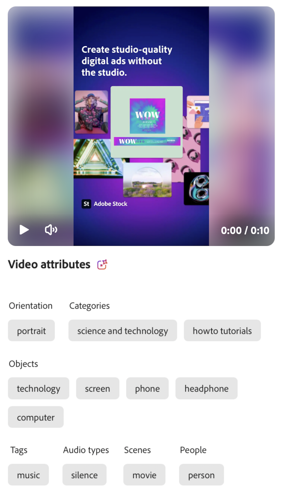

# Categorías de atributos

Una categoría de atributos es un grupo de clasificación que organiza atributos relacionados que comparten una característica común. Estas categorías ayudan a optimizar el descubrimiento, la identificación y la comprensión de atributos específicos al proporcionar un mayor contexto y facilitar su aplicación y uso.

GenStudio for Performance Marketing usa la IA y las capacidades de aprendizaje automático de Adobe para estudiar imágenes, vídeos y texto y aplicar [!UICONTROL atributos de recursos] según la probabilidad de que sean correctos. La lista de atributos de un recurso no es exhaustiva. Las Assets que contienen un conjunto completo de funciones pueden limitarse a las tres funciones más dominantes identificadas por la API.

## Funciones de imagen

Las características de imagen representan patrones o elementos distintos e informativos dentro de una imagen que se utilizan para el análisis con [!DNL Insights]. En la tabla siguiente se enumeran las categorías de funciones de imagen reconocidas por la API de GenStudio for Performance Marketing.

<!-- For the writer: turn off word wrap to work with these tables. Option + Z -->

| Categoría | Descripción | Ejemplo |
| ----------------------- | ----------------------------------------------------------------------------------------------------- | ------------------------------------------------------------------------------------------------------------------------------------------------------------------------------ |
| Ángulo de cámara | La ubicación y el ángulo de la cámara en relación con el sujeto. |                                                                                                                                                                                |
| Distancia al sujeto | Distancia entre la cámara y el sujeto de una imagen. | `close up`, `mid shot`, `long shot` |
| Ajuste de cámara | Configuración de los controles de la cámara para producir la imagen. |                                                                                                                                                                                |
| Color y tono | Evalúa los colores utilizados en los elementos de la imagen. Identifica de uno a tres colores de un conjunto de 40 colores predeterminados en las siguientes capas de imagen: **[!UICONTROL Colores de primer plano ]**—elementos de la capa frontal de la imagen **[!UICONTROL Colores de fondo]**—elementos de la capa posterior de una imagen | Valores de color: `Red`, `Dark_Red`, `Green`, `Bright_Green`, `Dark_Green`, `Light_Green`, `Mud_Green`, `Blue`, `Dark_Blue`, `Light_Blue`, `Royal_Blue`, `Black`, `White`, `Off_White`, `Gray`, `Dark_Gray`, `Silver`, `Cream`, `Magenta`, `Cyan`, `Yellow`, `Mustard`, `Khaki`, `Brown`, `Dark_Brown`, `Violet`, `Pink`, `Dark_Pink`, `Maroon`, `Tan`, `Purple`, `Lavender`, `Turquoise`, `Plum`, `Gold`, `Emerald`, `Orange`, `Beige`, `Lilac`, `Olive` |
| Temperatura de color | Describe la calidez o la frialdad general de los colores de la imagen. | Valores de tono o temperatura: `warm`, `cool`, `neutral` {width="200" zoomable="yes"} |
| Estilo de imagen | El tratamiento visual de una imagen. |                                                                                                                                                                                |
| Estado de iluminación | Tipo de luz de una imagen. |                                                                                                                                                                                |
| Objetos | Identifica uno o más elementos, entidades y elementos que conforman la imagen. | {width="200" zoomable="yes"} |
| Orientación | La posición de la imagen en relación con la relación de aspecto. | `landscape`, `portrait`, `square` |
| Personas | Cuando hay al menos una persona presente, uno o más atributos pueden describir a la persona o personas en la imagen. | {width="200" zoomable="yes"} |
| Géneros fotográficos | Detecta el asunto y la técnica utilizados para capturar una imagen, como `abstract` o `landscape` (distinto de la orientación horizontal). |           |
| Escenas | Detecta la configuración o el entorno representado en una imagen. |                                             |
| Etiquetas | Detecta objetos, elementos y otras características de imagen que no pertenecen a una clasificación específica. |                                      |

<!-- Not yet approved by legal
| Attention distribution  | The level of viewer attention spread across an image.                                                 | `high`, `medium`, `low`                                                                                                                                                                                                    |
| Content density         | The amount of information or detail in an image.                                                      | `high`, `medium`, `low`                                                                                                                                                                                                    |
-->

## Funciones de vídeo

Las características de imagen representan elementos, sonidos o patrones distintos e informativos dentro de un vídeo para su análisis con [!DNL Insights]. En la tabla siguiente se enumeran las categorías de funciones de vídeo reconocidas por la API de GenStudio for Performance Marketing.

| Categoría | Descripción | Ejemplo |
| ------------------- | ------------------------------------------------------------------------------------------------------------ | --------------------------------------------------------------------------------------- |
| Género de audio | Cuando hay música, el vídeo puede recibir una clasificación de estilo musical, como `electronic` o `classical`. |          |
| Categoría de género de audio | Cuando hay música, el vídeo puede recibir una clasificación amplia de género musical, como `acoustic` o `traditional`. |          |
| Modo de audio | Describe la atmósfera general o el tono del audio, como `relaxing` o `energetic`. |          |
| Tipos de audio | Cuando hay audio, el vídeo puede recibir una etiqueta para uno o más tipos de audio, como `music` o `speech`. |          |
| Objetos | Identifica uno o más elementos, entidades y elementos que aparecen en el vídeo. | {width="200" zoomable="yes"} |
| Orientación | La posición del vídeo en relación con la relación de aspecto del fotograma. | `landscape`, `portrait`, `square` |
| Personas | Cuando hay al menos una persona presente, uno o más atributos pueden describir a la persona o personas en el vídeo. |        |
| Escenas | La configuración o el entorno que se muestra en el vídeo. |        |
| Estilos | Detecta tratamientos visuales aplicados a elementos del vídeo, como `matte` o `neon`. |        |
| Etiquetas | Detecta objetos, elementos y otras características de vídeo que no pertenecen a una clasificación específica. |        |

## Funciones de texto

Las características de texto incluyen recuentos para determinados elementos de texto, como palabras, oraciones, emojis y clasificaciones de semántica, emoción y tono que se utilizan para el análisis con [!DNL Insights]. El texto también puede recibir una puntuación de legibilidad. Muy pronto.

<!-- Not yet approved by legal

The following table lists the image feature categories recognized by the GenStudio for Performance Marketing AI.

| Category             | Description | Example |
|----------------------|-------------|--------|
| Emojis Count         |             |        |
| HashTags Count       |             |        |
| Keywords             |             |        |
| Marketing Emotions   |             |        |
| Narratives           | Text that represents an overarching situation, theme, or a story. Narratives can communicate values, purpose, or identity that resonates with consumers on many levels.   |        |
| Persuasion Strategies|             |        |
| Readability          |             |        |
| Tone of voice        | | |
-->
