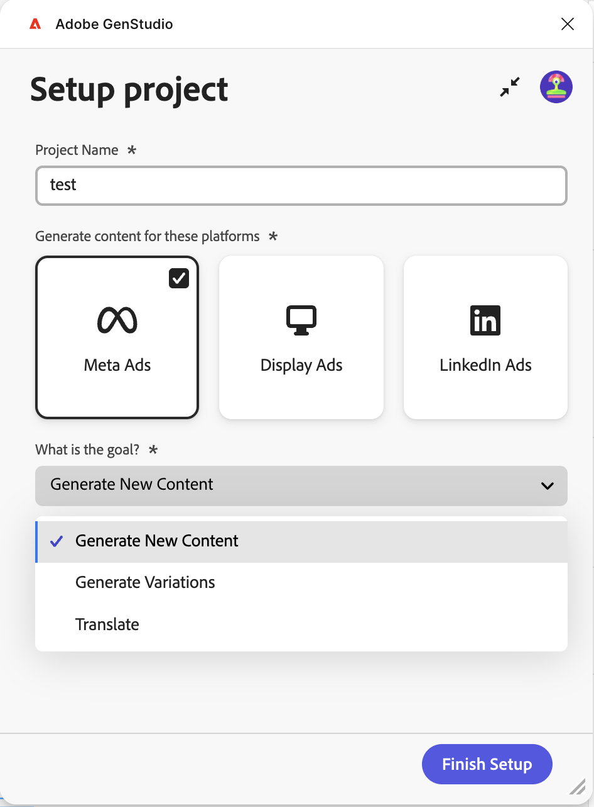
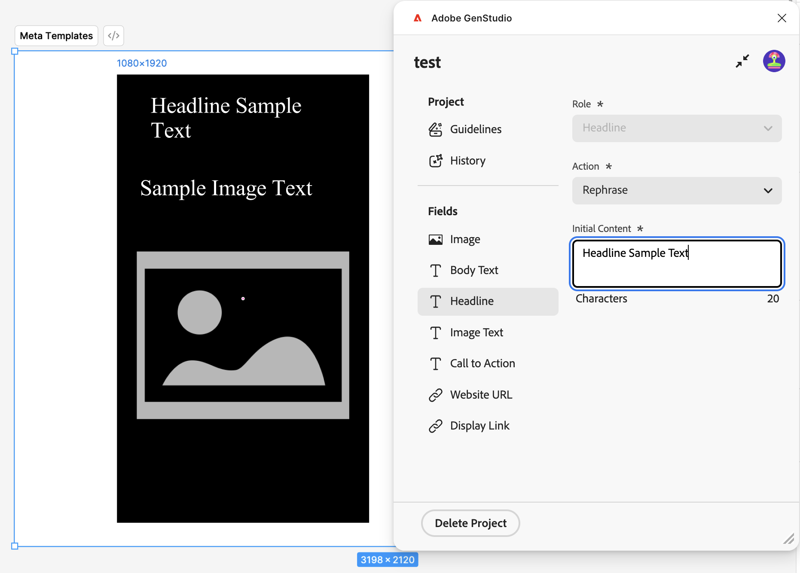
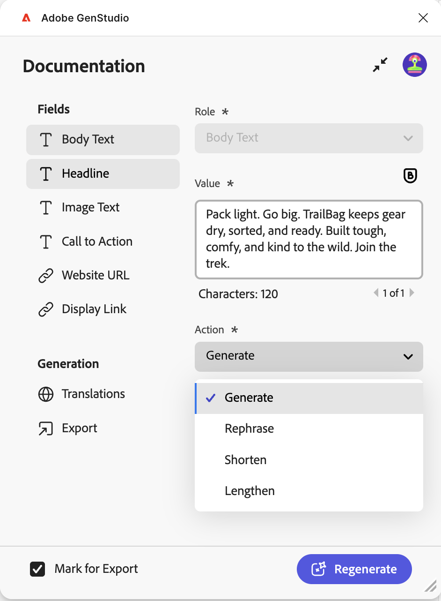
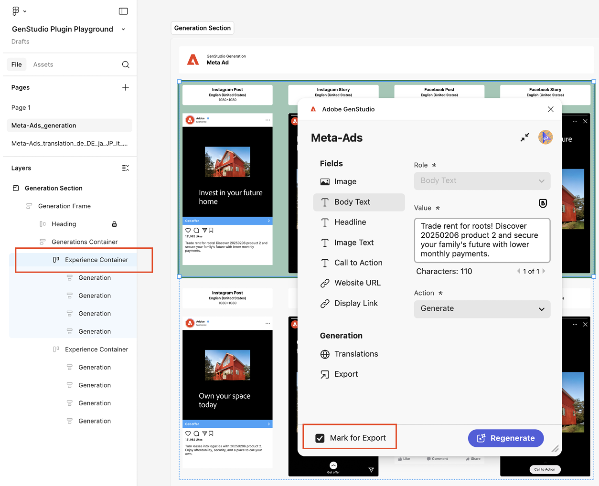

# Complemento Figma para GenStudio for Performance Marketing

El complemento GenStudio for Performance Marketing Figma añade un nuevo panel a la aplicación Figma que le permite generar contenido propio de la marca.
[Busque e instale el complemento desde el mercado de la comunidad Figma &#x200B;](https://www.figma.com/community/plugin/1604251370122180013/firefly-enterprise-and-genstudio).

Esta página describe cómo configurar y utilizar el complemento.

Las funciones de este complemento incluyen:

* Asigne elementos de texto de Figma a campos de GenStudio for Performance Marketing como `headline`, `body`, `on_image_text` y más.
* Generar un nuevo anuncio en la marca Meta, LinkedIn o Display [!DNL Experiences] basado en una marca, personalidad, producto y mensaje de texto.
* Cree [!DNL Experiences] directamente en el documento de Figma reemplazando el texto de los elementos de Figma asignados con los valores generados por GenStudio for Performance Marketing.
* Reformule, acorte, alargue o traduzca contenido existente en función de un mensaje.
* Traducir [!DNL Experiences] generado a varios idiomas.
* Exportar [!DNL Experiences] generado a un origen local como imágenes aplanadas.
* Exportar [!DNL Experiences] generado a GenStudio for Performance Marketing.
* Utilice opciones de plugin que se adapten a los elementos seleccionados en el lienzo Figma.

>[!VIDEO](https://video.tv.adobe.com/v/3478812?captions=spa&learn=on)

## Creación de una plantilla

El complemento requiere los dos primeros niveles del documento de Figma para seguir esta convención:

* **Sección**: representa el proyecto principal, que puede contener varias plantillas.
* **Marco**: representa una plantilla dentro de un proyecto. La plantilla se puede rellenar con texto, imágenes, componentes y otros elementos.

### Meta templates

Se admiten estos tamaños de plantilla:

Para publicaciones de Instagram o Facebook:

* Anchura: 1080 px (fija)
* Altura: 1080 px o 1350 px

Para historias de Instagram o Facebook:

* Anchura: 1080 px (fija)
* Altura: 1920 px

El complemento decide el cromo de la experiencia generada en función de la altura de la plantilla.

### Mostrar plantillas

No hay requisitos de tamaño fijo. Las plantillas de visualización admiten cualquier tamaño.

### Plantillas de LinkedIn

* Anchura: 1200 px (fija)
* Altura: 1200 px, 628 px, 2292 px, 1800 px o 1500 px

### Asignación de funciones de campo

El complemento debe comprender los diferentes elementos de la plantilla, como el titular, el texto independiente o la imagen.

Para asignar roles de elemento:

1. Seleccione un elemento en la plantilla (texto, imagen, etc.).
1. Utilice el menú desplegable para asignar una función.

El complemento recuerda estas asignaciones para utilizar con el contenido generado. Una función de campo\ se puede asignar a varios elementos de plantilla.

{width="600"}

### Excepciones de asignación de campos

{{$include /help/_includes/field-mapping-exceptions.md}}

## Generar contenido nuevo

Utilice GenStudio for Performance Marketing AI para generar o realizar variaciones de elementos en plantillas Figma.

1. Si utiliza GenStudio Plugin Playground o ya ha preparado plantillas, seleccione el nodo de la sección que contiene sus plantillas de publicidad. Puede hacerlo desde el panel **Capas** o haciendo clic directamente en la sección del lienzo.
   {width="500" zoomable="yes"}
1. En la ventana del complemento, introduzca un nombre de proyecto para las variaciones, elija una plataforma para el contenido y rellene el resto de la información necesaria. A continuación, haga clic en el botón **[!UICONTROL Finalizar configuración]**.
   {width="300" zoomable="yes"}
1. Seleccione [!DNL Brand], [!DNL Persona] y [!DNL Product] para usar en la generación de contenido.
1. Seleccione el número de variaciones que desea producir (hasta ocho).
1. Use el botón en **[!UICONTROL Seleccionar contenido]** para examinar y elegir imágenes de sus recursos. Los 40 recursos añadidos más recientemente aparecen primero y puede buscar otros recursos. Las imágenes seleccionadas cambian de tamaño automáticamente para adaptarse a las plantillas.
1. Introduzca un mensaje de texto. Cada campo de la lista **[!UICONTROL Campos]** tiene la opción **[!UICONTROL Acción]** establecida en **[!UICONTROL Generar]** para el contenido nuevo.
1. Asigne todas las funciones de campo. Consulte [Asignación de funciones de campo](#field-role-mapping).
1. Haga clic en el botón **[!UICONTROL Generar]**.

## Traducir o generar variaciones de copia de anuncio a partir de contenido existente

Utilice GenStudio for Performance Marketing AI para generar variaciones de copia de anuncios o traducir plantillas Figma.

1. Seleccione el nodo de sección que contiene las plantillas de publicidad. Puede hacerlo desde el panel **Capas** o haciendo clic directamente en la sección del lienzo.
   {width="500" zoomable="yes"}
1. En la ventana del complemento, introduzca un nombre de proyecto para las variaciones y elija una plataforma para el contenido.
1. En **[!UICONTROL ¿Cuál es el objetivo?]**, seleccione **[!UICONTROL Generar variaciones]** o **[!UICONTROL Traducir]** y luego haga clic en el botón **[!UICONTROL Finalizar configuración]**.
   {width="300" zoomable="yes"}
1. Seleccione [!DNL Brand], [!DNL Persona] y [!DNL Product] para usar en la generación de contenido.
1. Seleccione el número de variaciones que desea producir.
1. Use el botón en **[!UICONTROL Seleccionar contenido]** para examinar y elegir imágenes de sus recursos. Los 40 recursos añadidos más recientemente aparecen primero y puede buscar otros recursos. Las imágenes seleccionadas cambian de tamaño automáticamente para adaptarse a las plantillas.
1. Introduzca un mensaje de texto. Cada campo de la lista **[!UICONTROL Campos]** tiene la opción **[!UICONTROL Acción]** establecida en **[!UICONTROL Generar]** para el contenido nuevo.
1. Asigne todas las funciones de campo. Consulte [Asignación de funciones de campo](#field-role-mapping).
1. Seleccione cada tipo de campo para generar variaciones o traducir en el panel de la izquierda del complemento y pegue el contenido inicial en cada cuadro de **[!UICONTROL Contenido inicial]**.
   {width="60%" zoomable="yes"}
1. Haga clic en el botón **[!UICONTROL Generar]**.

## Traducir contenido después de la generación

1. Seleccione la generación que desee traducir.
   {width="200" zoomable="yes"}
1. Elija **[!UICONTROL Traducción]** y luego haga clic en **[!UICONTROL Traducir]**.
1. Seleccione el o los idiomas de destino.
1. Haga clic en **[!UICONTROL Seleccionar]**.

Los resultados de la traducción incluyen:

* Aparece una nueva página con contenido traducido.
* Cada traducción muestra el idioma o la configuración regional de destino.
* El contenido original permanece sin cambios en la página original.

{width="60%" zoomable="yes"}

## Otras acciones en los campos de contenido después de la generación

Cuando edita contenido existente en un campo, aparecen opciones útiles en el panel del complemento.

{width="300" zoomable="yes"}

Las opciones que se incluyen son:

* Cambie **[!UICONTROL Value]** para modificar el texto directamente. Cambiar este contenido se aplica automáticamente a todas las variaciones seleccionadas.
* La IA puede realizar muchas opciones de **[!UICONTROL Action]**, entre ellas:

| Acción | Descripción |
| --- | --- |
| **[!UICONTROL Generar]** | Generar una nueva variación del texto. |
| **[!UICONTROL Reformular]** | Generar una nueva variación del texto. |
| **[!UICONTROL Acortar]** | Genere una variación más corta del texto. |
| **[!UICONTROL Alargar]** | Generar una variación más larga del texto. |

Después de seleccionar una opción **[!UICONTROL Action]**, vuelva a generar el contenido con el botón **[!UICONTROL Regenerar]**.

## Exportar experiencias

Las variaciones se pueden exportar desde Figma como GenStudio for Performance Marketing [!DNL Experiences].

1. Seleccione el contenido que desea exportar en el lienzo Figma mediante uno de los procedimientos siguientes:
   * Seleccione la sección de generación en el lienzo y, a continuación, haga clic en **[!UICONTROL Marcar todo para exportar]** en el panel del complemento.
     {width="200" zoomable="yes"}
   * Seleccione una generación individual en el lienzo y, a continuación, haga clic en **[!UICONTROL Marcar para exportación]** en el panel del complemento.
     {width="200" zoomable="yes"}
1. Seleccione el elemento Exportar del menú de la barra lateral.
   {width="60%" zoomable="yes"}
1. Seleccione un destino.
1. Haga clic en **[!UICONTROL Exportar]** para exportar el contenido.

Se crea un archivo ZIP en el panel del complemento o aparece un vínculo a **[!UICONTROL Abrir en GenStudio]**. Use el vínculo ZIP para elegir dónde guardar el archivo o seleccione **[!UICONTROL Abrir en GenStudio]**.

## Historial de generación

El complemento mantiene un historial de cambios para cada campo. En la página de plantilla, elija **[!UICONTROL Historial de generación]** en la barra lateral del complemento.

{width="80%" zoomable="yes"}

## Resolución de problemas

Tenga en cuenta estas prácticas recomendadas y sugerencias si el texto o las imágenes no se reemplazan en variaciones generadas.

### Campos asignados

Si no se reemplazan texto o imágenes, compruebe que los campos se hayan asignado a las funciones de campo de GenStudio en la interfaz de usuario del complemento. Consulte [Asignación de funciones de campo](#field-role-mapping).

### Confirmar fuentes disponibles

La fuente de un campo de texto debe estar disponible en el equipo para que el reemplazo se produzca durante la generación. Confirme que todas las fuentes utilizadas en el archivo están disponibles en el equipo, especialmente si el archivo se creó en el equipo de otra persona.

### Considerar compatibilidad con funciones de campo

Algunos canales solo admiten el reemplazo en campos específicos. Tenga en cuenta las excepciones para la asignación de funciones de [campo](#field-role-mapping).
