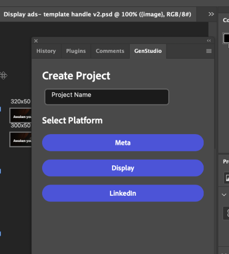
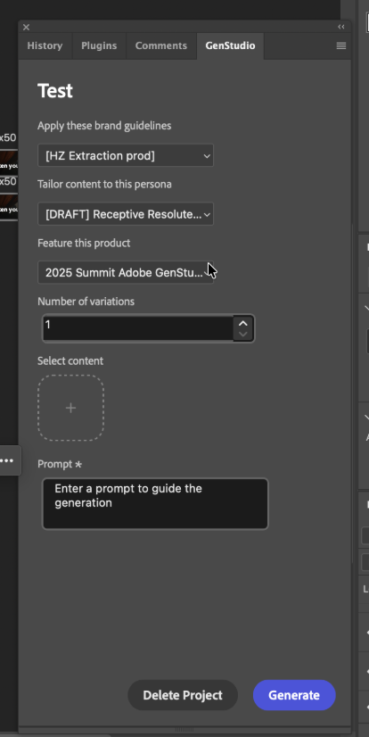
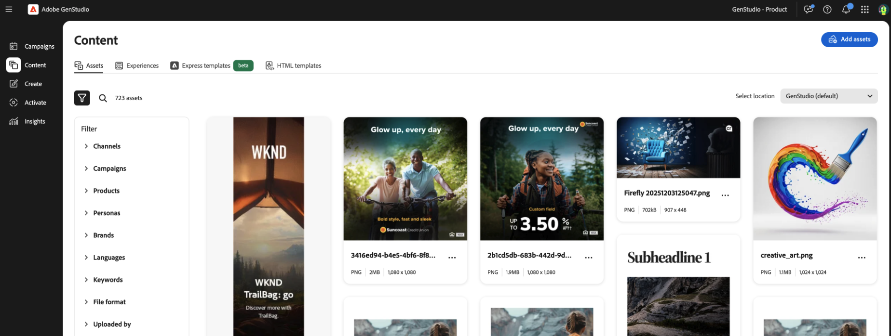

# GenStudio Photoshop para GenStudio for Performance Marketing

GenStudio Photoshop agrega un panel a Adobe Photoshop que le permite generar contenido propio de la marca.

Esta página describe cómo instalar y configurar el complemento y cómo utilizarlo.

Las funciones de este complemento incluyen:

* Inicie sesión en una instancia de GenStudio for Performance Marketing con un Adobe ID
* Asignar campos de generación de contenido de GenStudio for Performance Marketing a capas de texto en un documento de Photoshop
* Especifique una marca, un producto, un perfil y un mensaje de texto para generar contenido
* Opcionalmente, agregue una imagen para reemplazar la imagen de la plantilla
* Previsualizar variaciones de contenido no relacionadas con la marca generadas
* Aplicar contenido generado a capas asignadas en el documento actual
* Creación de traducciones de contenido en la marca
* Exportar [!DNL Experiences] generado a GenStudio for Performance Marketing

>[!VIDEO](https://video.tv.adobe.com/v/3478808?learn=on)

## Instalación del complemento

Siga estas instrucciones para instalar el complemento.

### Requisitos previos

* aplicación de escritorio de Creative Cloud
* Photoshop, versión mínima 25.6.0

### Pasos de instalación

1. Descargue y actualice el complemento desde Creative Cloud Marketplace en Adobe Exchange.
1. Busque **GenStudio Photoshop** en Adobe Exchange.
1. Siga las indicaciones para instalar el complemento.

### Desinstalar el complemento

1. Inicie la aplicación de escritorio de Creative Cloud.
1. Haga clic en la opción **[!UICONTROL Complementos]**.
1. Haga clic en los puntos suspensivos **[!UICONTROL (...)]** en la tarjeta de GenStudio for Creative Cloud para ver las opciones.
1. Elija **Desinstalar**.

## Creación de una plantilla

Para generar contenido, necesita una plantilla de GenStudio for Performance Marketing creada a partir del documento de Photoshop.

Para crear una plantilla compatible con GenStudio:

1. Abra un documento en Photoshop.
1. Identifique una capa de texto para el contenido generado.
1. Cambie el nombre de la capa con el formato de convención de nombre de campo: `{<name_of_generated_field>}`. Por ejemplo, `{body}`, `{headline}` y `{cta}`.
1. Cambie el nombre de las capas de todos los [campos requeridos por el canal destinado al tipo de plantilla](../../user-guide/templates/customize-template.md#recognized-field-names).

| Canal | Campos obligatorios para la generación | Campos opcionales para la generación |
| --- | --- | --- |
| LinkedIn | `{on_image_text}`, `{image}` | `{headline}`, `{introductory_text}`, `{cta}`, `{website_url}` |
| Meta | `{on_image_text}`, `{image}` | `{body}`, `{headline}`, `{cta}`, `{website_url}`, `{display_link}` |
| Mostrar | `{body}`, `{image}` | `{headline}`, `{cta}`, `{website_url}` |

Tenga en cuenta que varias capas pueden compartir la misma designación de campo, pero cada capa solo puede especificar un campo. Por ejemplo, si hay varias mesas de trabajo en el documento:

* Puede especificar una capa `{headline}` en cada mesa de trabajo.
* Puede especificar varias `{headline}` capas en una sola mesa de trabajo.
* No puede especificar que una sola capa reciba los nombres de campo `{headline}` y `{cta}`.

### Requisitos de tamaño de plantilla

#### Meta templates

Para publicaciones de Instagram y Facebook:

* Anchura: 1080 px (fija)
* Altura: 1080 px o 1350 px

Para historias de Instagram y Facebook:

* Anchura: 1080 px (fija)
* Altura: 1920 px

El complemento decide el cromo de la experiencia generada en función de la altura de la plantilla.

#### Mostrar plantillas

No hay requisitos de tamaño fijo. Las plantillas de visualización admiten cualquier tamaño.

#### Plantillas de LinkedIn

* Anchura: 1200 px (fija)
* Altura: 1200 px, 628 px, 2292 px, 1800 px o 1500 px

El documento ya está listo para utilizarse con el complemento.

## Generar contenido nuevo

1. Abra Photoshop.
1. Abra un documento de plantilla compatible con GenStudio que haya creado (consulte las instrucciones anteriores) o utilice la plantilla de inicio de GenStudio for Performance Marketing: `branding-template-acrobat-handlebars.psd`.
1. Abra el panel de complementos en **[!UICONTROL Complementos]** > **[!UICONTROL GenStudio]**.
1. Haga clic en el botón **[!UICONTROL Iniciar sesión]**. Si se le pide permiso para abrir una dirección URL, marque **Recordar mi elección** y, a continuación, haga clic en **[!UICONTROL Permitir]**.
1. Utilice el explorador web para iniciar sesión con un perfil que tenga acceso a GenStudio for Performance Marketing.
1. Seleccione el canal (Meta, LinkedIn o Display) que se aplica a la plantilla que ha abierto.
   {width="300" zoomable="yes"}
1. Seleccione el contexto [!DNL Brand], [!DNL Persona] y [!DNL Product] para la generación de contenido.
   {width="300" zoomable="yes"}
1. Seleccione el número de variaciones que desea producir.
1. Use el botón en **[!UICONTROL Seleccionar contenido]** para examinar y elegir imágenes de sus recursos. Los 40 recursos añadidos más recientemente aparecen primero y puede buscar otros recursos. Las imágenes seleccionadas cambian de tamaño automáticamente para adaptarse a las plantillas.
1. Proporcione un mensaje de texto para el contenido en el cuadro **[!UICONTROL Mensaje de texto]**.
1. Haga clic en el botón **[!UICONTROL Generar]**. Las variaciones aparecen en las tarjetas en el panel del complemento.

Los nuevos documentos se añaden al espacio de trabajo de Photoshop con contenido generado aplicado a los campos de plantilla. Estos documentos se denominan con un sufijo de variación numerado.

## Traducir contenido

Los usuarios pueden traducir el contenido a los idiomas admitidos después de la generación de copias.

1. Haga clic en **[!UICONTROL Traducir]** después de generar la copia de anuncio con el complemento.
1. Seleccione uno o varios idiomas para la traducción.
1. Haga clic en el botón **[!UICONTROL Traducir]**.

Los nuevos documentos se añaden al espacio de trabajo de Photoshop con contenido generado aplicado a los campos de plantilla. Estos documentos se denominan con un sufijo de variación numerado.

## Exportar experiencias a GenStudio

Los usuarios pueden seleccionar la exportación después de la generación o traducción del contenido. Las experiencias exportadas se rellenan en la sección de contenido de GenStudio for Performance Marketing.

{width="90%"}

## Convertir fotogramas de Figma a Photoshop

Los marcos Figma se pueden convertir en documentos de Photoshop y exportar para su uso con GenStudio Photoshop. Para entender cómo convertir marcos, vea la sección [Convertir marcos de Figma a Photoshop](figma-plugin.md#convert-figma-frames-to-photoshop) en la página del complemento Figma.

## Resolución de problemas

Tenga en cuenta estas prácticas recomendadas y sugerencias si el texto o las imágenes no se reemplazan en variaciones generadas.

### Campos asignados

Si el texto o las imágenes no se reemplazan, confirme que los campos están asignados correctamente con llaves `{}` (no paréntesis `()`).

### Confirmar fuentes disponibles

La fuente de un campo de texto debe estar disponible en el equipo para que el reemplazo se produzca durante la generación. Confirme que todas las fuentes utilizadas en el archivo están disponibles en el equipo, especialmente si el archivo se creó en el equipo de otra persona.

### Excepciones de asignación de campos

{{$include /help/_includes/field-mapping-exceptions.md}}
