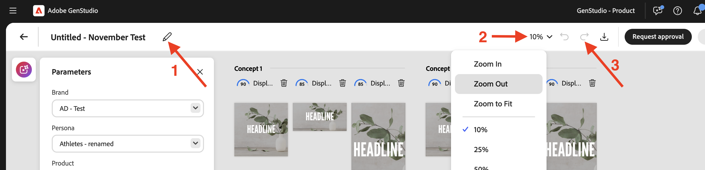
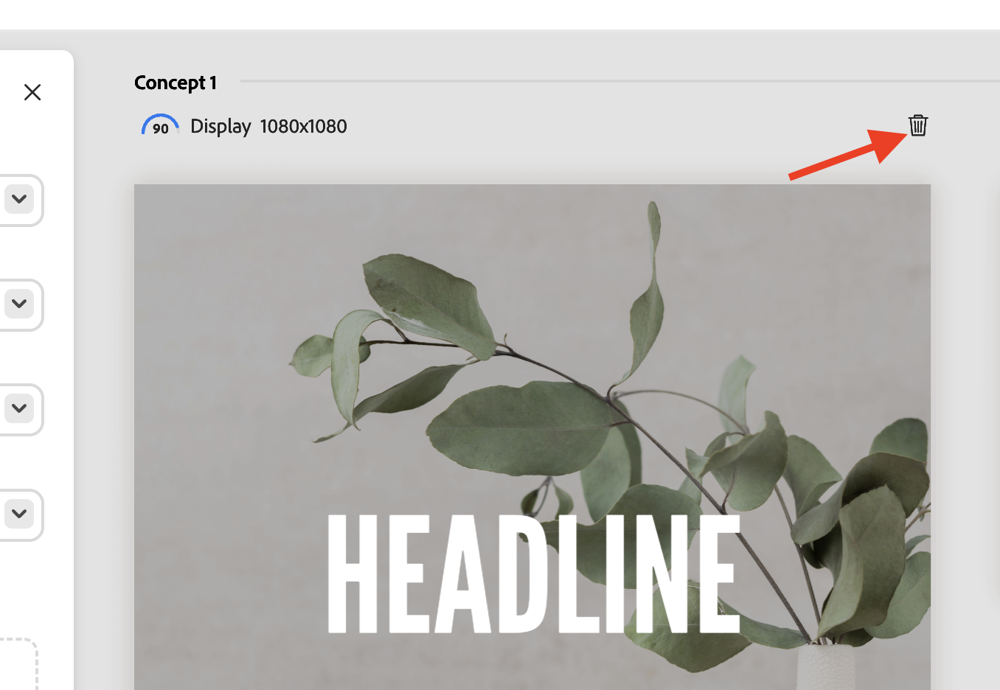
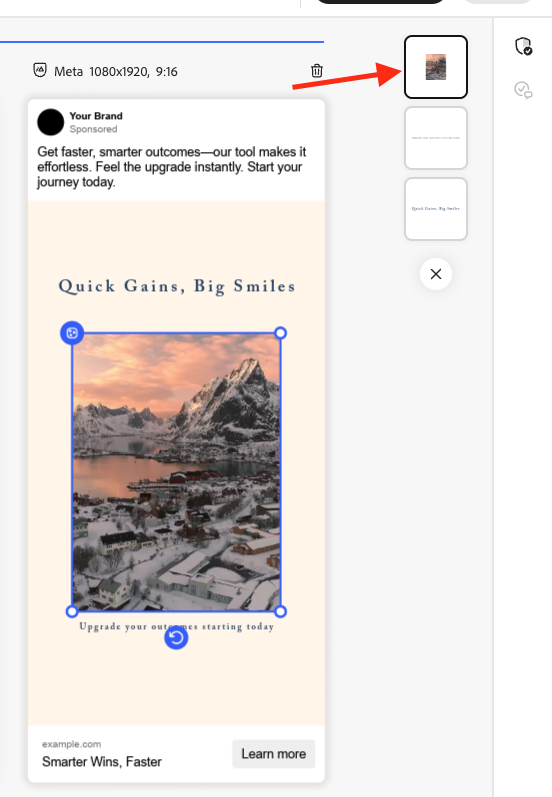
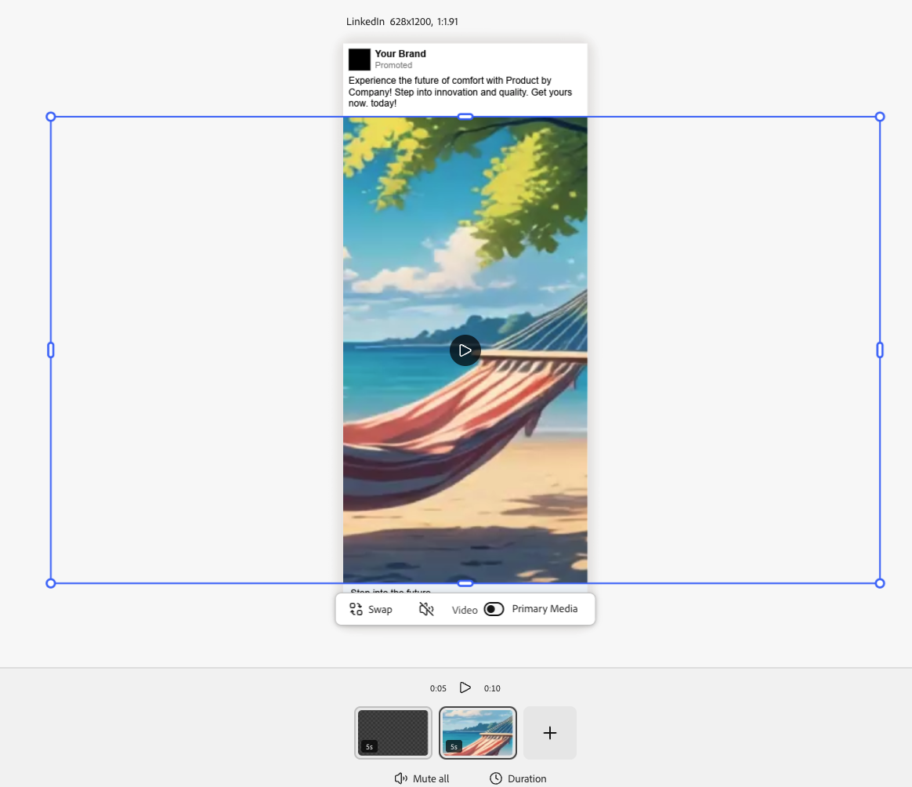
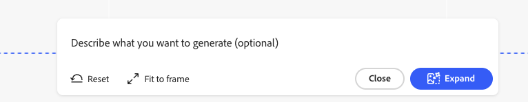

# Usando [!DNL Adobe Express] plantillas

[!DNL GenStudio for Performance Marketing] puede usar plantillas que se han creado y diseñado en [!DNL Adobe Express]. Incluya recursos de marca de [!DNL Adobe Express] y use estas poderosas herramientas para integrarlos en atractivas campañas de marketing y [!DNL Experiences].

Esta guía explica los requisitos y las características con las plantillas de [!DNL Adobe Express]. Para obtener más sugerencias y prácticas recomendadas, consulte [Prácticas recomendadas para usar plantillas](/help/user-guide/templates/best-practices-for-templates.md#express-to-genstudio-template-best-practices).

## Acerca de las plantillas de [!DNL Adobe Express]

En [!DNL Adobe Express], se pueden crear [nuevos documentos utilizando las plantillas de inicio existentes](https://helpx.adobe.com/es/express/web/documents-and-presentations/text-flow-template.html?x-product=Helpx%2F1.0.0&x-product-location=Search%3AForums%3Alink%2F3.7.5) que se proporcionan en la aplicación, o con [plantillas personalizadas que pueden incluir restricciones de marca útiles](https://helpx.adobe.com/es/express/web/brands-libraries-projects/create-manage-brands/edit-shared-template.html) como:

- [Elementos bloqueados](https://helpx.adobe.com/es/express/web/invite-collaborate/object-locking.html) que no se pueden modificar
- Restricciones de bloqueo que controlan cómo los usuarios pueden desbloquear elementos cuando es necesario

La configuración de bloqueo establecida en la plantilla de [!DNL Adobe Express] también se aplicará en [!DNL GenStudio for Performance Marketing]. Use [las [!DNL Adobe Express] instrucciones para crear una plantilla personalizada con restricciones de marca](https://helpx.adobe.com/es/express/web/brands-libraries-projects/create-manage-brands/template-control.html).

Para utilizar fuentes personalizadas en una plantilla Express, los administradores deben aceptar primero la oferta correspondiente a Fuentes personalizadas en Admin Console, que se incluye como parte del derecho de licencia Express.

## Buscar plantillas rápidas

Los usuarios verán las pestañas nuevas en Crear para seleccionar plantillas rápidas. Se puede acceder a las plantillas rápidas en GenStudio for Performance Marketing cuando estas son:

- Creado por el usuario
- Compartido con el usuario
- Compartido con la organización del usuario, con la misma organización de IMS en ambas aplicaciones

Busque cualquier plantilla rápida disponible en el flujo de trabajo Crear, después de seleccionar un tipo de plantilla. Las plantillas rápidas solo están disponibles para los tipos:

- [!DNL Meta]
- [!DNL Display]
- [!DNL LinkedIn]
- [!DNL TikTok]

En la barra superior debajo de **[!UICONTROL Seleccionar plantilla]**, busque **Plantillas rápidas**.

{width=70%}

Al seleccionar una plantilla [!DNL Express] y hacer clic en **[!UICONTROL Usar]**, los parámetros de borrador previo y la solicitud aparecerán en un panel emergente de la izquierda. Haga clic en el botón **[!UICONTROL Generar]** para crear contenido nuevo con la plantilla seleccionada.

{width=90%}

>[!IMPORTANT]
>
>Durante la generación de contenido, las capas de la plantilla Express se etiquetarán automáticamente con los roles de campo de [!DNL GenStudio for Performance Marketing]. Los elementos de una plantilla también se pueden [etiquetar manualmente](#manual-tagging-of-templates).

## Acerca de las variantes y [!DNL Experiences] con [!DNL Adobe Express] plantillas

Las plantillas de [!DNL Express] ofrecen muchas de las mismas características con las que estará familiarizado al [administrar otras variantes](https://experienceleague.adobe.com/es/docs/genstudio-for-performance-marketing/user-guide/create/manage-variants#manually-edit-text). Sin embargo, hay algunas mejoras importantes para optimizar cualquier flujo de trabajo para el contenido de [!DNL Express]. Esta sección describe características exclusivas de la implementación de [!DNL Adobe Express].

### Generar automáticamente varios tamaños

Cuando se han creado [varias páginas para un recurso en [!DNL Express]](https://helpx.adobe.com/es/express/web/arrange-layers-and-pages/add-pages.html), esas páginas se transfieren a cualquier plantilla creada a partir de ese recurso. Las páginas rápidas se generarán en tamaños diferentes del contenido creativo de [!DNL GenStudio for Performance Marketing].

Cuando existe contenido de varios tamaños para un recurso en [!DNL Express], se pueden generar variantes para todos esos tamaños en una sola generación.

### Cambiar posición y tamaño de elementos

Se puede cambiar el tamaño de los elementos de una plantilla o moverlos para que se ajusten simplemente haciendo clic en ellos y arrastrándolos en el panel Lienzo.

Para cambiar el tamaño, haga clic en un elemento y arrástrelo desde un punto de esquina.

### Funciones de encabezado del panel Lienzo

Utilice los botones del encabezado del panel Lienzo para:

1. Cambiar el título del borrador
1. Cambiar el nivel de zoom para ver
1. Deshacer y rehacer cambios

### Asignar comentarios del grupo de experiencia

Asigne comentarios a cada grupo de variantes generadas. Estas etiquetas de comentarios ayudan a la IA a comprender qué variantes deben tenerse en cuenta en las generaciones posteriores.

Pulse &quot;...&quot; para abrir el menú desplegable:

- Buen resultado
- Producción deficiente
- Eliminar: elimina el grupo de variantes.

### Eliminar una variante

Se puede eliminar un solo tamaño de variante que se haya generado en un grupo de experiencias mediante el icono de papelera.

{width=300}

### Barra espaciadora a panorámica

Mantenga **[!UICONTROL Espacio]** para habilitar la función de hacer clic y arrastrar para &quot;extraer&quot; el panel de vista Lienzo.

También puede mover el panel de vista con un desplazamiento de dos dedos.

### Editar texto manualmente

Puede editar los campos de texto en las variantes generadas. Refine el texto para su audiencia experimentando con diferentes frases y expresiones y aplicando formato. Por ejemplo, puede aplicar negrita y alinear a la derecha el texto de una variante para ajustarse al diseño de una imagen.

{width=60%}

El formato de texto disponible incluye:

- Negrita, cursiva y subrayado
- Color del texto (negro, blanco o colores de marca)
- Alineación izquierda, central y derecha
- Listas con viñetas y ordenadas
- Tamaño de texto
- Superíndice o subíndice

**Para editar texto manualmente en variantes generadas**:

1. Después de generar un conjunto de variantes, haga doble clic en el texto editable de una variante.
1. Introduzca el nuevo texto.
1. Para dar formato al texto, haga clic en el elemento del cuadro de texto o escríbalo. Las opciones de formato aparecerán en una barra emergente. Si mantiene pulsada la tecla Mayús, se oculta la barra para ver el texto.
1. Haga clic fuera del campo de texto para guardar los cambios.

### Ver capas

Puede seleccionar rápidamente una capa individual de una variante y realizar cambios, como volver a generar secciones o recortar imágenes. Al seleccionar una capa individual, se resaltan los campos editables o las imágenes dentro de la capa.

**Para ver las capas de una variante**:

1. Después de generar un conjunto de variantes, haga clic en un campo editable o en una imagen dentro de una variante. Las capas aparecerán en una línea de mosaicos en la parte superior derecha.
   {width=50%}
1. Haga clic en un mosaico de capa para seleccionarlo. La capa seleccionada se realzará para la variante.
1. Realice las modificaciones necesarias en la capa seleccionada.

### Reescribir secciones

[!DNL GenStudio for Performance Marketing] tiene la funcionalidad integrada para regenerar secciones de variantes generadas. Puede reformular, acortar o alargar el texto, o agregar nuevos mensajes para generar contenido nuevo.

Por ejemplo, puede volver a generar la sección de titulares de una variante de anuncio de Meta para ver el aspecto que tendrá con un recurso de fondo específico. Puede **[!UICONTROL Reformular]**, **[!UICONTROL Acortar]** o **[!UICONTROL Alargar]** el contenido de texto de una sección, o **[!UICONTROL Regenerar]** texto con un símbolo del sistema.

{width=50%}

**Para reescribir secciones de variante individuales**:

1. Después de generar un conjunto de variantes, haga clic con el botón derecho en cualquier texto editable de una variante. Aparecerá el icono de la varita.
1. Haga clic en el icono de la varita para abrir el panel Reescribir.
1. Para modificar el texto existente, selecciona **[!UICONTROL Reformular]**, **[!UICONTROL Acortar]** o **[!UICONTROL Alargar]**.
1. Para generar nuevas opciones de fraseo, seleccione **[!UICONTROL Volver a generar]** e introduzca una nueva solicitud.
   1. Haga clic en **[!UICONTROL Generar]**.
1. Los resultados aparecen como opciones en el panel. Seleccione la opción que desee y haga clic en **[!UICONTROL Reemplazar]**. La variante se actualiza con el texto revisado.

{width=50%}

### Recortar recursos

Puede recortar y cambiar manualmente la posición de los recursos de imagen en variantes generadas individualmente con la herramienta Recortar.

**Para recortar y cambiar la posición de imágenes en variantes**:

1. Después de generar un conjunto de variantes, haga doble clic en un recurso para activar el cuadro delimitador.
1. Ajuste el cuadro delimitador de la imagen arrastrando desde cualquier borde o esquina, o arrastre toda la imagen a la posición deseada.

### Intercambiar recursos

Puede agregar o intercambiar imágenes, logotipos aprobados o recursos de vídeo en variantes generadas directamente desde la interfaz de usuario del lienzo.

**Para agregar o intercambiar recursos en una variante**:

1. Después de generar un conjunto de variantes, haga clic en un recurso (o en el área del recurso de imagen si todavía no existe una imagen). Aparecerá un icono de intercambio.
1. Haga clic en el icono de intercambio para abrir la página Seleccionar recursos.
1. Utilice los filtros y la función de búsqueda en la vista de contenido de los recursos de GenStudio para restringir aún más los resultados de búsqueda.
1. También puede utilizar imágenes disponibles en repositorios conectados de [!DNL Adobe Experience Manager] (AEM) Assets Content Hub seleccionando ese repositorio en el menú **[!UICONTROL Ubicación]**.
1. Haga clic para seleccionar una imagen y haga clic en **[!UICONTROL Usar]**. La imagen se agrega o intercambia en la variante aplicable.

### Etiquetado manual de plantillas

Los elementos de las plantillas se etiquetan automáticamente durante [la generación de plantillas](#find-express-templates) en el flujo de trabajo Crear. Sin embargo, estos elementos también se pueden etiquetar manualmente.

**Para etiquetar manualmente un elemento de plantilla**:

1. Seleccione el elemento en la plantilla.
1. Utilice la lista desplegable para seleccionar la etiqueta para ese elemento.
   {width=80%}

Las opciones de etiquetado varían según el tipo de elemento.

### Restricciones de bloqueo de plantilla

Las plantillas pueden incluir [elementos bloqueados](https://helpx.adobe.com/es/express/web/invite-collaborate/object-locking.html) que se transfieren desde [!DNL Express] y controlan cómo se pueden modificar algunas características. La plantilla respeta estos ajustes, que también se pueden modificar:

1. Seleccione un elemento bloqueado en la plantilla.
1. Haga clic en el icono de bloqueo en la parte superior izquierda del elemento seleccionado.
1. Seleccione la opción correcta para desbloquear el elemento.
   {width=60%}

### Conjunto de vídeo

Las plantillas que incluyen vídeos pueden aprovechar las ventajas de las funciones de Conjunto de vídeo.

**Para usar el ensamblado de vídeo**:

1. Seleccione una experiencia y haga clic en el botón **[!UICONTROL Editar]** para ingresar al modo de enfoque y usar las características del ensamblado de vídeo. Solo se muestra la variante única y la línea de la escena a lo largo de la parte inferior.
   {width=70%}
1. Ajuste su experiencia de vídeo. Las opciones de montaje de vídeo incluyen:
   - Reproducir vídeos
   - Silenciar y reactivar sonido
   - Añadir nuevo contenido de vídeo con el botón &quot;+&quot;
   - Configuración de duración del vídeo
   - Cambie el orden del contenido de vídeo arrastrando y soltando
1. Cuando hayas terminado de editar el vídeo, usa el botón **[!UICONTROL Salir]** de la parte superior para guardar los cambios y volver al lienzo infinito.

### Modificación de imágenes con Generative Expand

Las capas de imagen pueden tener sus límites ampliados con IA para adaptarse a cualquier dimensión deseada en una experiencia.

**Para expandir una imagen con Expansión generativa**:

1. Seleccione una capa de imagen desbloqueada y haga clic en el botón **[!UICONTROL Expandir]** en la parte inferior del marco de imagen.
   {width=70%}
1. Tire del fotograma hasta las dimensiones deseadas en las que se expandirá la imagen. Aparecerá la ventana de opciones Expandir. En las opciones de Expandir, puede facilitar la expansión mediante lo siguiente:
   - Introducción de una solicitud
   - Elección del ajuste al marco
   - Restablecer las dimensiones
     {width=50%}
1. Haga clic en **[!UICONTROL Expandir]** para crear la generación. Las variantes para elegir aparecerán en la parte inferior del marco.
1. Seleccione la mejor variante y haga clic en **[!UICONTROL Conservar]**.
   {width=50%}

{width=60%}

### Validación de marca

Utilice el panel _Comprobación de contenido_ para mantener la coherencia en la identidad de la marca, los estándares de accesibilidad de ADA, las directrices de la plataforma y la alineación de las variantes.

Consulte [Validación de marca](/help/user-guide/guidelines/brand-validation.md).

## Revisar y aprobar

Después de editar y ajustar las variantes, apruebe y publique su contenido con [el flujo de trabajo de revisiones y aprobación](https://experienceleague.adobe.com/es/docs/genstudio-for-performance-marketing/user-guide/approve/overview).

